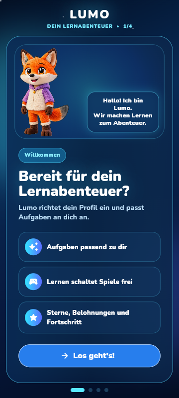
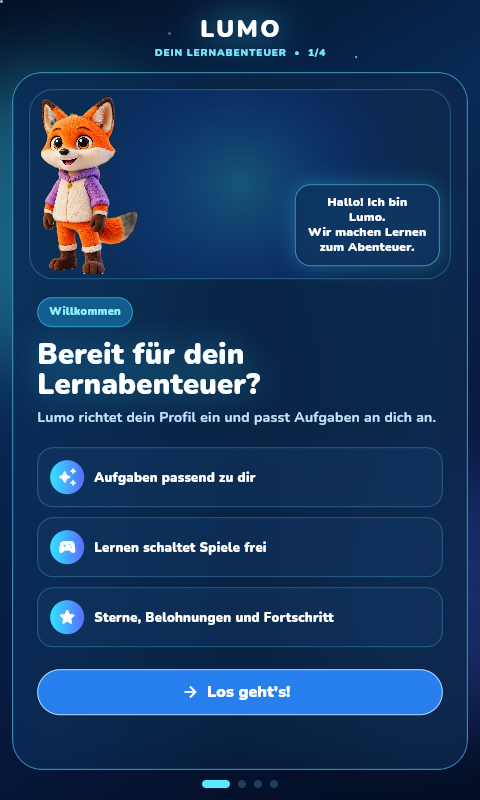
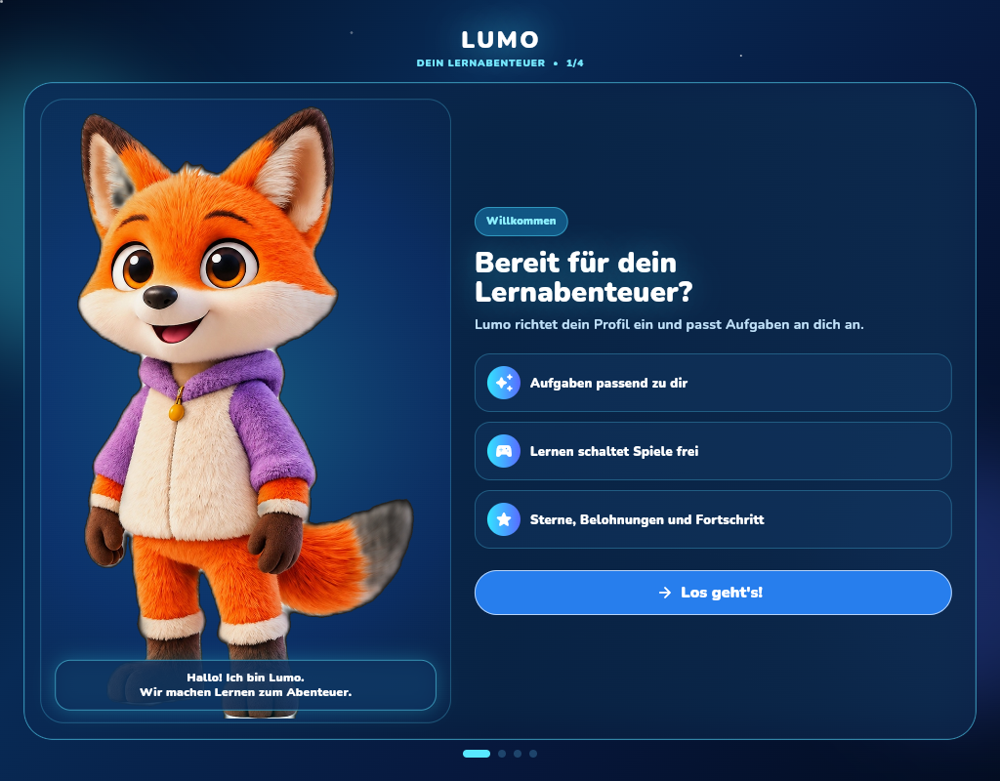
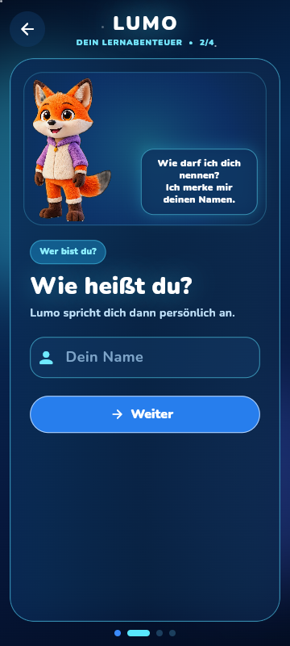
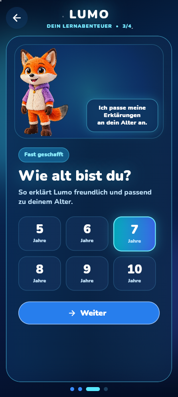
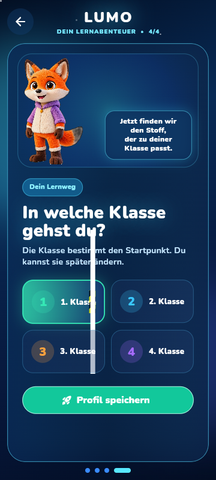
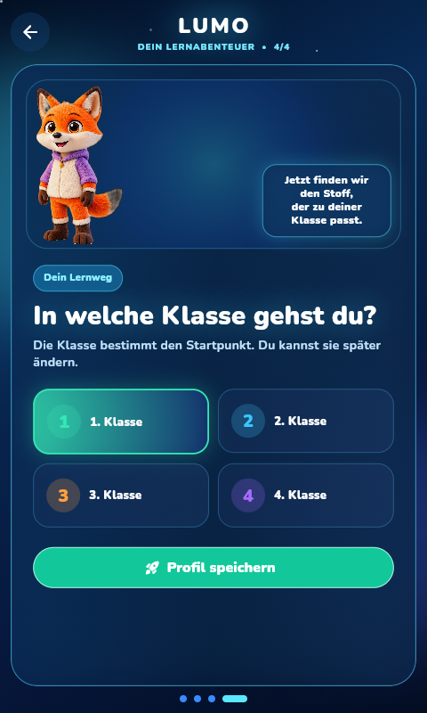
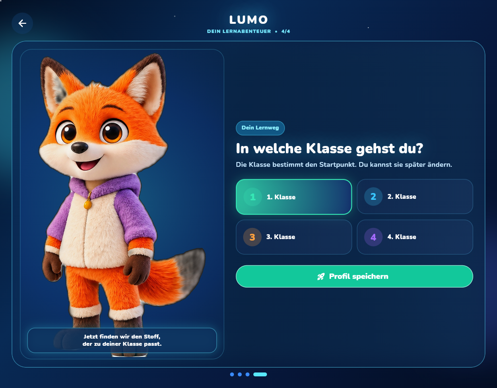

# Lumo Onboarding Hologlass — 2026-10-05

## Ziel
Den bisherigen warm/orangefarbenen First-Run-Flow durch dieselbe dunkelblaue Cyan-Glas-/Hologramm-Sprache ersetzen, die Heinz für die aktuelle Lumo-App verlangt.

## Generierte Designvorlage
Vor der Implementierung wurde eine neue Onboarding-Konzeptserie erzeugt und in einzelne Screen-Referenzen zerlegt:
- Splash / Start
- Willkommen
- Wer bist du? / Name
- Schulklasse
- Interessen
- Ziel
- Elternbereich
- Fertig
- Übergang
- Homescreen-Referenz

Die Laufzeitimplementierung rendert Text, Eingabefelder, Buttons, Alter und Klassenwahl absichtlich nativ in Flutter. Dadurch bleiben Accessibility, Lokalisierung und Fold-Responsivität erhalten; die generierten Bilder dienen als Art-Direction statt als starre Vollbild-Screenshots.

## Aktueller Code
- `lib/features/onboarding/lumo_onboarding_holo_screen.dart`
- `lib/main.dart` nutzt diesen Flow im First Run.
- Der alte `lumo_onboarding_screen.dart` bleibt vorerst als Vergleich und Fallback im Repo.

## Funktionsvertrag unverändert
Persistiert werden weiterhin ausschließlich die vorhandenen `UserProfile`-Felder:
- Name
- Alter
- Klasse

Keine Migration bestehender Profile, keine Wallet-/Reward-Änderung.

## Pflichttexte für bestehende QA
Folgende Captions bleiben sichtbar:
- `Willkommen`
- `Wie heißt du?`
- `Wie alt bist du?`
- `In welche Klasse gehst du?`
- `Weiter`
- `Profil speichern`

## Visuelle Regeln
- Midnight Blue / Cyan / Electric Blue
- Glasflächen mit Blur und dünner Cyan-Kante
- Orange nicht mehr als dominierende Onboarding-Farbe
- Lumo bleibt klarer Mittelpunkt
- große, einfache Touch-Ziele
- Compact/Fold: vertikal
- breite Innenansicht: Lumo links, Formular rechts

## Nächste Prüfung
1. `flutter analyze`
2. bestehende Onboarding-Widget-/Android-QA
3. 360x800, 480x800, Fold innen und breite Tabletansicht
4. Tastatur bei Namenseingabe
5. lange Namen
6. sehr kleine Höhe / Landscape
7. bestehendes Profil darf den Onboarding-Flow nicht erneut sehen

Keine Behauptung eines echten Fold-Gerätetests, bevor dieser tatsächlich ausgeführt wurde.

## QA-Ergebnisse am 2026-10-05

Geprüfter Code-Stand: `0cec80966c41158a60ecad50c2ae9f3663a2a959`. `main.dart` importiert
`lumo_onboarding_holo_screen.dart` und zeigt ihn bei fehlendem Profil; vorhandene Profile
gehen weiterhin direkt in die App. `UserProfile` wurde nicht erweitert.

### Teststatus

- `flutter analyze`: **FAIL**, Exit 1. 18 Analyzer-Warnungen und weitere Infos betreffen
  unveränderte Dateien außerhalb des Onboardings; `lumo_onboarding_holo_screen.dart` hat
  keine Analyzer-Diagnose.
- `flutter test`: **PASS**, 613 Tests bestanden, 4 übersprungen.
- `python3 -m unittest tools.android_qa.tests.test_onboarding_captions -v`: **PASS**, 4 Tests.
- `python3 -m unittest discover -s tools/android_qa/tests -p 'test_*.py' -v`: **PASS**,
  182 Tests bestanden, 8 übersprungen. Das sind QA-Helfertests, kein Android-Gerätetest.
- Pflichttexte im Screen-Text geprüft: `Willkommen`, `Wie heißt du?`, `Wie alt bist du?`,
  `In welche Klasse gehst du?`, `Weiter`, `Profil speichern`. Name-/Alters-/Klassen-
  überschriften und ihre Aktionen waren zusätzlich im Laufzeit-Semantikbaum sichtbar.
- Laufzeitansicht: **PASS** mit einem temporären Flutter-Web-Harness, das den Screen,
  `UserProfile`, das produktive Nunito-Font-Set und `assets/images/lumo_fox.png` verwendet.
  Die Aufnahmen sind echte Flutter-Renderings bei Device-Scale-Factor 1; kein Screenshot
  wurde aus einem Designbild zusammengesetzt.
- 360×800 und 480×800 bleiben vertikal; bei 1024×800 wird das breite Links-/Rechts-Layout
  verwendet. In den geprüften Welcome- und Klassenansichten wurde kein Clippen oder
  Überlappen beobachtet.
- Vollständiger App-Webstart: **SKIP**. Das Repository ist nicht für Web konfiguriert;
  der direkte Start scheitert zusätzlich an nicht als JavaScript-Zahlen darstellbaren
  64-Bit-Literalen in `lib/domain/learning/seed_memory_service.dart`. Die Aufnahmen
  stammen daher ausdrücklich nur vom isolierten Onboarding-Screen.
- Android-/Fold-Gerät, Tastatur, lange Namen, geringe Höhe/Landscape: **SKIP**; in dieser
  Umgebung war kein Android-Gerät oder Emulator verfügbar. 1024×800 ist ein breiter
  Laufzeit-Viewport, kein Nachweis eines echten Fold-Geräts oder Scharniertests.

### Laufzeitaufnahmen

| Ansicht | 360×800 | 480×800 | breit 1024×800 |
|---|---|---|---|
| Willkommen |  |  |  |
| Name |  | — | — |
| Alter |  | — | — |
| Klasse |  |  |  |

### VISUAL_GAPs

- **Erfüllt:** dunkelblaue Basis, cyan-/elektroblaue Akzente, abgerundete Panels,
  feine Cyan-Kanten und klare Nunito-Hierarchie. Orange ist keine dominante
  Onboarding-Flächenfarbe.
- **Offen:** Der Hintergrund ist ein abstrakter Verlauf mit Sternpunkten/Leuchteffekten,
  keine räumlich dichte Hologrammwelt. Die stark deckenden Glasflächen lassen wenig
  Hintergrund durchscheinen.
- **Offen:** Lumo ist ein statisches PNG, keine animierte Figur oder eigene Pose je Schritt.
  Die Sprechblase nutzt Nunito statt einer handschriftlichen Akzentschrift.
- **Vergleichsgrenze:** Für das Onboarding liegen in diesem Checkout keine passenden
  Original-Konzeptbilder vor; daher kein pixelgenauer Bildvergleich.
