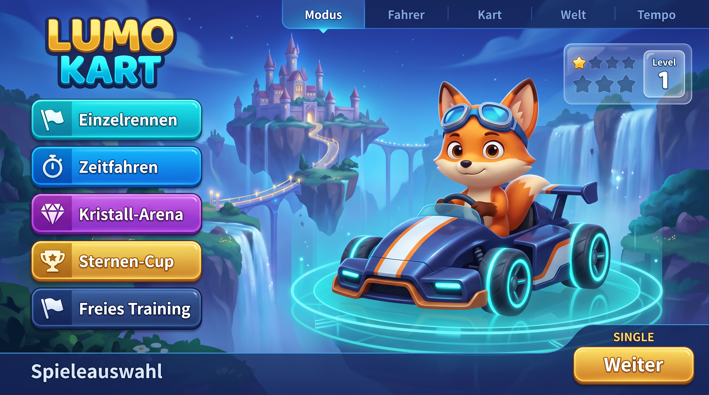
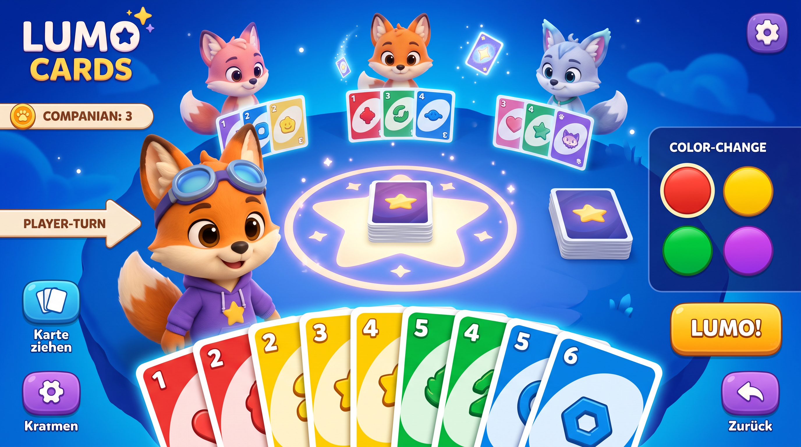
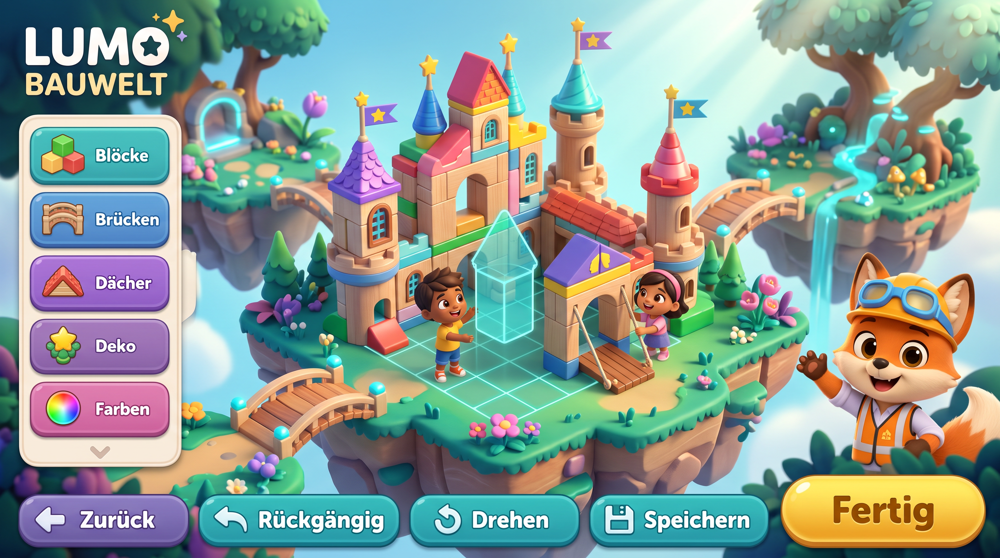
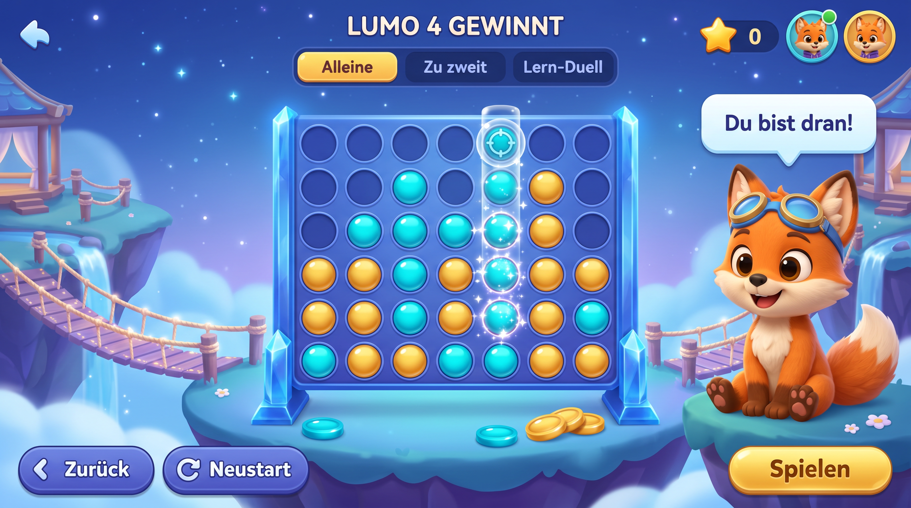

# Lumo Kart, Cards, Bauwelt und 4 Gewinnt – generierte Designvorschläge

**Diese vier PNGs sind Konzeptgrafiken, keine Screenshots einer ausführbaren App.** Sie zeigen mögliche Anordnungen für vorhandene, funktionierende Spielmodule. Die Bildsprache ist nur dann verbindlich, wenn sie mit den zehn Originalbildern unter `../references/` übereinstimmt. Vorhandenes Lern-App-Layout und die unveränderte Lumo-Figur haben stets Vorrang.

| Bild | Inhalt | Implementierung |
| --- | --- | --- |
|  | Fuchs, Kart, schwebende Inseln, fünf Spielmodi | `lumo-godot/scripts/games/kart_garage_menu.gd` |
|  | Glossy Kartentisch, farbige Karten, Lumo-Reaktionen | `lib/features/games/lumo_cards/lumo_cards_screen.dart`, `widgets/lumo_card_table.dart` |
|  | echte freie Baufläche, Module, Lumo-Architekt | `lumo-godot/scripts/creative/build_world.gd` |
|  | tatsächliches 7×6-Raster, zwei Steinfarben | `lib/features/games/connect_four/lumo_connect_four_game.dart` |

Die konkrete Erstellung erfolgte durch die verbundene Bildgenerierung am 10.10.2026. Diese Entwürfe ersetzen keine vorhandenen `assets/lumo_design/`-Dateien und werden nicht ungeprüft als Spieloberfläche installiert. Eingangsansichten, Spiellogik, Speicherstände und Einstellungen müssen in der echten Flutter-/Godot-Laufzeit erhalten bleiben.

**Umsetzung und Kontrolle:** `../CLAUDE_SONNET_5_5_PRODUKTIONSAUFTRAG.md`, `../DESIGN_BESTANDSSCHUTZ.md` und `../REFERENZEN.md`.
