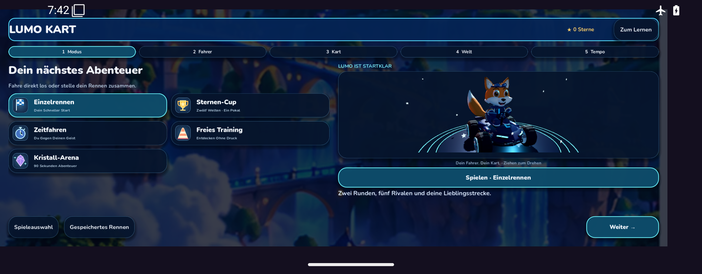
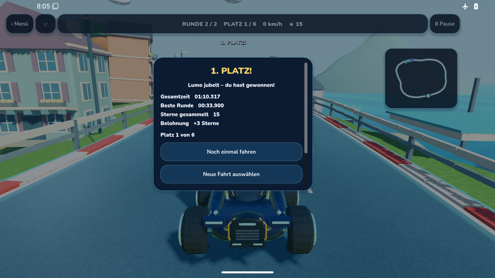

# APK 1919: ursprünglicher Android-API-35-Rennnachweis

Diese Bilder stammen aus der tatsächlich installierten APK im Android-Emulator API 35. Sie sind keine Konzeptbilder, Widgettests oder Desktop-Godot-Render.

## Quellen und Prüfbefund

- App: `d07b2b48593b939a2a0446fcb83a25a2b2a59db6`, Godot: `d140e5b05cb5afacfe675559b78da4254cb1daed`.
- APK: `0.12.12+1919`, 205.316.096 Bytes, SHA-256 `8e2ea31fed333fd8e89becd073b100c53ce9449017badb43ab4bc28022cc51aa`.
- Die im Emulator installierte APK wurde zurückgelesen und entspricht diesen Bytes.
- [Ursprünglicher Kart-Job API 35: SUCCESS](https://github.com/Ullmann27/lumo-lernen/actions/runs/37975946198/job/113988997714).
- [Unverändertes Originalartefakt 11641449935](https://github.com/Ullmann27/lumo-lernen/actions/runs/37975946198/artifacts/11641449935).
- [Zusätzliche reine Byteprüfung der Originalbelege](https://github.com/Ullmann27/lumo-lernen/actions/runs/37985733243): ZIP, Quellenidentität, installierte APK, Ergebnis und PNGs geprüft. Die beiden hier abgelegten PNGs wurden zusätzlich nach dem Abruf unabhängig dekodiert und anhand SHA-256 geprüft.

**Der ursprüngliche Gesamtworkflow 37975946198 bleibt fehlgeschlagen**, weil der separate API-36-Kart-Test bei der Suche nach der Gas-Einstellung scheiterte. Der erfolgreiche API-35-Fall ersetzt diese ausstehende Prüfung nicht. [API-36-Fehlernachweis](../lumo-1919-api36/README.md).

## Tatsächlicher Rennablauf

Der bestehende Test bediente die sichtbare Android-/Godot-Oberfläche. Er wählte Sonnenhafen, Fuchs, Comet und „Gemütlich“, aktivierte die öffentliche automatische Beschleunigung und fuhr mit neutralem Stick und der vorhandenen Anfängerhilfe. Es wurden weder Positionen noch Zielzustand, Punkte oder Belohnungen in Speicherstände injiziert.

Nachgewiesen sind 16 Kontrollpunkte über zwei Runden, Pause bei Kontrollpunkt 2 mit stabilem pausierten Speicherstand, Größenwechsel, Fortsetzen, regulärer Abschluss, Offline-Wiederaufnahme desselben Ergebnisses, Rückkehr zur Lern-App und Bestätigung des Host-Ereignisses. Ergebnis: Platz 1/6, 70,317 Sekunden Spielzeit, beste Runde 33,900 Sekunden, 0 Resets, 15 Streckentokens. Der Host vergab genau +3 Sterne und 0 XP; nach erneutem Öffnen und Rückkehr blieb die Belohnung unverändert.

Die Spielzeit ist **keine reale Durchlaufdauer und kein Leistungswert des Emulators**. Acht originale Screenrecord-Segmente liegen im Originalartefakt. Sie wurden vom Test auf Existenz, Größe und Hash geprüft; hier wird keine vollständige manuelle Sichtung dieser Videos behauptet.

## Visuelle Prüfung dieser zwei Aufnahmen

### Startmenü — 2316 × 904 Pixel

Die Modusauswahl, echte 3D-Vorschau, direkte „Spielen“-Schaltfläche und bisherige mehrstufige Auswahl sind sichtbar. Header, Navigationsschaltflächen und Android-Gestenbereich überlagern sich in dieser Aufnahme nicht. Das ist ein emuliertes breites Anzeigeformat, kein Foto eines Fold7. Der dargestellte Fuchs hat weiterhin einen deutlich stilisierten, einfachen Material- und Geometriegrad; diese Aufnahme begründet keine finale AAA-Freigabe der Figur.

### Reguläres Rennergebnis — 1920 × 1080 Pixel

Die sichtbare Ergebnisansicht zeigt dieselben Zeiten, Platzierung und +3 Sterne wie der ausgelesene reguläre Rennabschluss. Minimap, Kart und Strecke bleiben hinter dem Dialog sichtbar. Der Dialog besitzt eine Scrollleiste; die Rückkehr zur Lern-App wird durch den anschließenden UI-/Host-/Wallet-Test belegt, nicht durch eine in diesem Bild sichtbare Rückkehrschaltfläche. Die Strecke und ihre Umgebung sind weiterhin überwiegend einfach gestaltet; ein vollständig neuer Premium-Kurs ist damit nicht abgenommen.

## Leistungsgrenze

Der softwaregerenderte Emulator lieferte zwei rohe Ressourcenaufnahmen des nativen Prozesses: PSS 246.279 bzw. 205.434 KiB, RSS 331.828 bzw. 248.580 KiB. Das sind einzelne Messpunkte und keine Spitzenwerte einer Speicher- oder Wärmeprüfung. CPU-Zähler wurden roh gespeichert; mangels erfasster OS-Taktfrequenz wird daraus keine Auslastung berechnet. Hardware-FPS, GPU-Kosten und thermisches Verhalten eines echten Fold7 wurden nicht gemessen.

Die vollständige strukturierte Originalauswertung steht in [ORIGINAL-RESULT.json](ORIGINAL-RESULT.json); Hashes und Herkunft der unveränderten PNGs stehen in [MANIFEST.json](MANIFEST.json).
