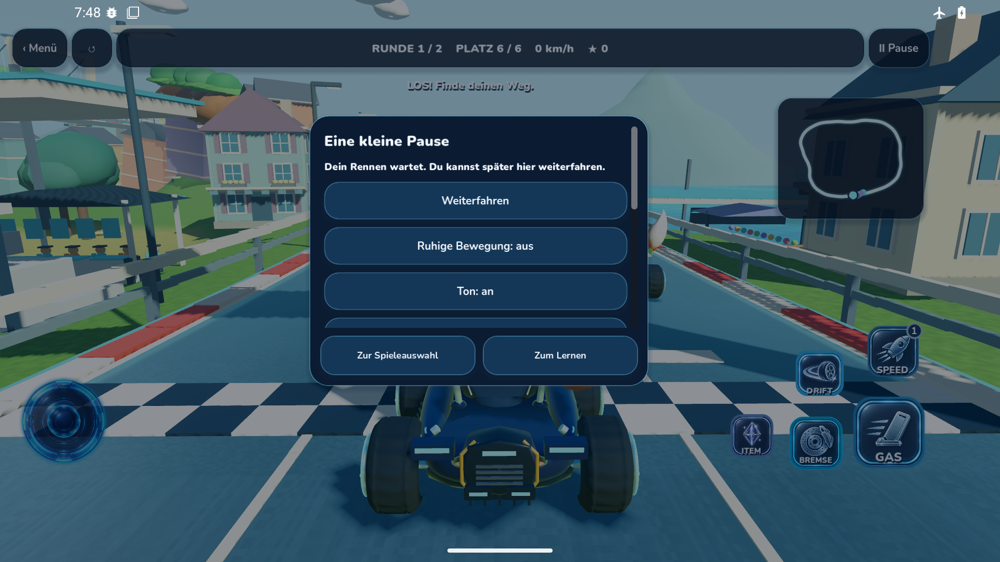
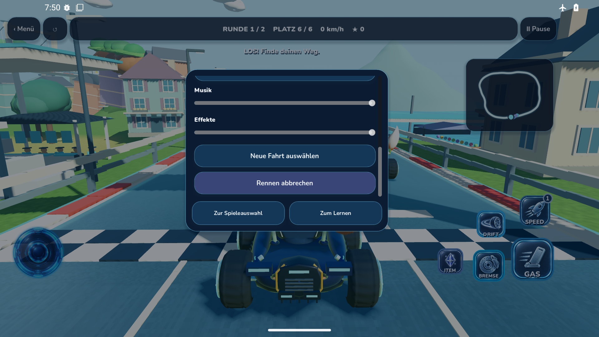

# Originaler Android-Fehler: Gas-Schalter vor dem Rennen

**Tatsächliche Android-API36-Aufnahmen der installierten APK 0.12.12+1919. Keine Konzepte, keine Desktop-Renderings und kein bestandener kompletter Rennlauf.**

Der [ursprüngliche Job 113988997647](https://github.com/Ullmann27/lumo-lernen/actions/runs/37975946198/job/113988997647) scheiterte an `Screenshot tile OCR deadline exceeded`. Die vorherige Creative-Kart-Prüfung bestand; der folgende vollständige Rennlauf erreichte den automatischen Gas-Schalter nicht.

App: `d07b2b48593b939a2a0446fcb83a25a2b2a59db6`; Godot: `d140e5b05cb5afacfe675559b78da4254cb1daed`.

APK-SHA256: `8e2ea31fed333fd8e89becd073b100c53ce9449017badb43ab4bc28022cc51aa`.

## Sichtbare Reihenfolge

Die erste stabile beobachtete Geste zieht von `(912,559)` nach `(912,322)`. Aufnahme 3 zeigt noch den Listenanfang; Aufnahme 4 zeigt bereits das Ende mit Musik, Effekten, „Neue Fahrt auswählen“ und „Rennen abbrechen“. Die Automation zieht dort wiederholt weiter nach unten und verbraucht ihr unverändertes 180-Sekunden-Budget. Der Gas-Schalter liegt laut Produktquelle zwischen diesen Ansichten. Eine konkrete Ursache der verzögerten beziehungsweise großen Scrollbewegung ist durch die Bilder allein nicht bewiesen.

## Integrität und Ausweichverfahren

`ORIGINAL-MANIFEST.json` enthält ursprüngliche Artefakt-ID, ZIP-SHA, Bild-SHAs, Pixelmaße und die unveränderten Scrollbeobachtungen. Beide PNGs wurden aus den Originalartefakten übernommen, ohne Schnitt, Skalierung oder Retusche. Die getrennten Diagnosejobs [37983454689](https://github.com/Ullmann27/lumo-lernen/actions/runs/37983454689) und [37983964964](https://github.com/Ullmann27/lumo-lernen/actions/runs/37983964964) prüften diese Daten. Root rekonstruierte die PNGs anschließend vollständig aus den Logblöcken und prüfte ihre SHA256 nochmals unabhängig.

Die zusätzliche Prüfung war erforderlich, weil die lokale Arbeitsumgebung ab 19:32 UTC nicht mehr erreichbar war. Die Diagnosejobs änderten weder App, Spielstände noch Testergebnisse und führten kein neues Rennen aus. Ein grüner Diagnosejob bedeutet ausschließlich, dass die Originalfehlerdaten korrekt gelesen wurden.

**Offen:** gezielte Reparatur und erneuter echter Android-Rennnachweis. Die ursprüngliche Niederlage bleibt erhalten; die endgültige Gesamtabnahme wird durch diese Dokumentation nicht ersetzt.
