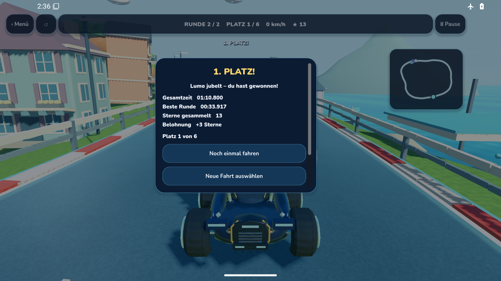

# Lumo 1919 – Quellen, Prüfbelege und verbleibende Arbeit

**Status: VERIFIED_BY_AGGREGATION. Android-16-Nachlauf und abschließende Quellenprüfung bestanden am 10. Oktober 2026.**

## Unveränderter Produktstand

| Gegenstand | Gebundene Quelle |
|---|---|
| Lern-App | [d07b2b48593b939a2a0446fcb83a25a2b2a59db6](https://github.com/Ullmann27/lumo-lernen/commit/d07b2b48593b939a2a0446fcb83a25a2b2a59db6), Draft [PR241](https://github.com/Ullmann27/lumo-lernen/pull/241) |
| Godot | [d140e5b05cb5afacfe675559b78da4254cb1daed](https://github.com/Ullmann27/lumo-godot/commit/d140e5b05cb5afacfe675559b78da4254cb1daed), Draft [PR42](https://github.com/Ullmann27/lumo-godot/pull/42) |
| Getrennter Prüfharness | [2247999b902d4c9a756df0c17318d0dd60bebf86](https://github.com/Ullmann27/lumo-lernen/commit/2247999b902d4c9a756df0c17318d0dd60bebf86), Draft [PR242](https://github.com/Ullmann27/lumo-lernen/pull/242) |
| APK | 0.12.12+1919, **205.316.096 Bytes**; ursprünglicher [Build 37975946198 / Job 113974160562](https://github.com/Ullmann27/lumo-lernen/actions/runs/37975946198/job/113974160562) |

APK SHA-256: `8e2ea31fed333fd8e89becd073b100c53ce9449017badb43ab4bc28022cc51aa`.

Der neue Prüfharness verwendet dieselben APK-Bytes. Änderungen betreffen Figuren-/Start-/Aquariumgeometrie im Produkt, eine begrenzte Antwortzuordnung in der Lern-App sowie getrennte Prüfkorrekturen; `SOURCE-CHANGES.json` im Nachweispaket trennt diese Umfänge.

## Bereits vorhandene Nachweise

- **Flutter:** 836 PASS, vier bestehende Skips. Identische Profilregression: Original 2 FAIL / 1 PASS, Kandidat 3 PASS; zusätzlich 58 Bestandsprüfungen, ohne Addition zur Gesamtsuite.
- **Godot:** [Stage2 37975876572](https://github.com/Ullmann27/lumo-godot/actions/runs/37975876572) erfolgreich; 2.325 Posen-, 23 Tiefen-/Kontakt- und 69 StartHero-Prüfpunkte. Original-Renderings belegen den sichtbaren Entwicklungsstand.
- **API35:** Fünf Spieljobs bestanden. Kart prüft zwei Runden, 16 Kontrollpunkte, Pause, Offline-Rückkehr, ACK und Deduplizierung; drei Belohnungssterne, null XP. Die übrigen Spielmodi sind nur im tatsächlich ausgeführten Umfang belegt.
- **Prüfharness:** [Replayjob 114103321767](https://github.com/Ullmann27/lumo-lernen/actions/runs/38015042640/job/114103321767) erfolgreich: 108 Bestandsprüfungen, fünf Gasfälle und 19 konstruierte Recorderfälle mit Original-RED/Kandidat-GREEN. Die Recorderfälle sind kein authentischer PID-Replay und kein Spielabschluss.

Der separate [ChangeReview 38015044969](https://github.com/Ullmann27/lumo-lernen/actions/runs/38015044969) auf `2247999` hat **819 PASS / 21 SKIPs**. Die 17 zusätzlichen Skips betreffen bytegleiche Capture-Tests: `app_tour_capture_test.dart` zwölf (2 Größen × 6 Bereiche), `iq_capture_test.dart` fünf. Der Produktworkflow setzt `LUMO_TOUR_DIR`, ChangeReview nicht; deshalb **836/4 gegenüber 819/21**. Kein Godot-Skip-Grund; die Suiten werden nicht addiert.

## Abgeschlossener technischer Nachweis

Die [API36-Nachprüfung 38015042640](https://github.com/Ullmann27/lumo-lernen/actions/runs/38015042640) einschließlich Videoabschluss hat bestanden. Die [Abschlussaggregation 38018373892](https://github.com/Ullmann27/lumo-lernen/actions/runs/38018373892), Commit `8e4f20c3f7ddcb8d671e9d19911bc8f9c58aa684`, Originalartefakt `11657121749`, bindet die erfolgreichen Einzelprüfungen, Quellstände und APK-Bytes und erhält die Fehlerhistorie.

Der unveränderte Aggregationsbericht ist [QA-RESULTS.json](./QA-RESULTS.json). Das [API36-Ergebnisbild](./06-completed-result-phone.png) ist eine bytegleiche Original-PNG aus dem angegebenen erfolgreichen API36-Lauf. Weitere Original-PNGs im Nachweispaket behalten jeweils Herkunft, Größe und SHA-256; ein Standbild ersetzt keinen Laufzeitnachweis.

## Fehlerhistorie und Restarbeit

**37975946198** bleibt FAILURE wegen Gas-Suche, **37987154620** wegen Signaturleser, **37987900281** wegen Videoabschluss. Erfolgreiche Teilabschnitte ändern diese Gesamtzustände nicht.

[Issue #233](https://github.com/Ullmann27/lumo-lernen/issues/233) bleibt offen: korrigiert ist die Antwortzuordnung, nicht vollständige Mehrkind-Isolation. Das Update prüfte Testbasis 1602, keine umfassende 1918→1919-Migration. Es wurde keine Datenmigration aktiviert.

Die Nachweise stammen aus Desktop-/Emulatorprüfungen. Physischer Fold7-Betrieb, 60 FPS, Audioabnahme, vollständige Sprechanimation und ein kompletter Premiumkurs sind nicht belegt. Modell-/Materialübergänge und eine validierte Alternativroute bleiben offen. `VISUAL-ACCEPTANCE.md` begrenzt das visuelle Urteil. Kein Main-Merge und keine öffentliche Produktfreigabe.

## Unveränderte Originalaufnahmen

API36-Emulator, Run 38015042640 / Job 114103433871: 01:10.800 Spielzeit, 16 Kontrollpunkte, Platz 1 von 6. Originalartefakt 11656893224; PNG-SHA256 `9182c819ccf3d7587b77ec9eed5165efc6573a6c0400e7a8c69d91e5d1adb4bc`. Das Standbild ist kein Framerate- oder Hardwarebeleg.

Die stabile, im ursprünglichen Ergebnisbericht gebundene Flutter-Aufnahme zeigt die Spieleauswahl mit drei Sternen und 0/400 XP. Originalartefakt und Job wie oben; PNG-SHA256 `791b6da7547d21b0f9bc9ec9a583c9992341d7407e28a23587ebff7ebb55faa6`. Die anders benannte historische Datei `13-completed-race-returned-to-app.png` zeigt noch die nativen Ergebnisaktionen und wird nicht als Flutter-Bild bezeichnet.

[Dateimanifest](./MANIFEST.json) · [Originale Aggregationsbindung](./AGGREGATION-LOCK.json) · [Unabhängige visuelle Prüfung](./VISUAL-ACCEPTANCE.md)
